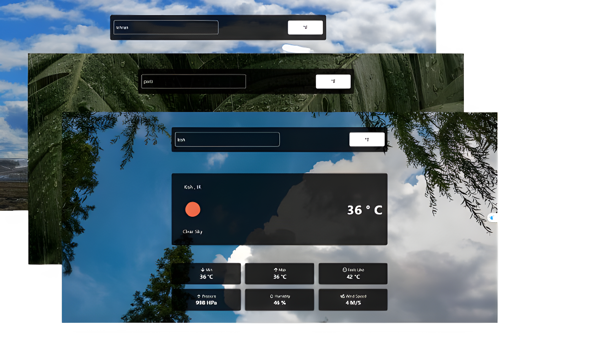

## 🌤️ Weather App | اپلیکیشن آب و هوا


  
## 📝 Description | توضیحات
A simple and modern weather application that lets you search for any city and shows you the real-time weather conditions.

This project supports:
- 🌡️ **Temperature unit toggle** (Fahrenheit ↔ Celsius)
- 🌄 **Dynamic background** that changes based on the current weather

---

اپلیکیشن ساده و مدرن هواشناسی که می‌تونید با وارد کردن نام شهر، اطلاعات دقیق آب و هوای لحظه‌ای اون شهر رو مشاهده کنید.

ویژگی‌های کلیدی:
- 🌡️ **تغییر واحد دما** بین سلسیوس و فارنهایت
- 🌄 **تغییر بک‌گراند** با توجه به وضعیت فعلی هوا


## 👀 Screenshots | تصاویر پروژه

### 🖥️ Desktop Version | نسخه دسکتاپ


### 📱 Mobile Version | نسخه موبایل


## 🔗 Live Demo | نسخه آنلاین  
👉 [weather-app-sand-alpha.vercel.app](https://weather-app-sand-alpha.vercel.app)


## 🚀 Tech Stack | تکنولوژی‌ها
- React   
- Axios  
- Tailwind CSS


## ⚙️ Features | امکانات
- ✅ Get weather info by city name  
- ✅ Real-time temperature, humidity, wind  
- ✅ Toggle between Celsius and Fahrenheit  
- ✅ Background changes based on weather  
- ✅ Responsive design  

---

- ✅ نمایش اطلاعات آب‌وهوا با نام شهر  
- ✅ دما، رطوبت و سرعت باد به‌صورت لحظه‌ای  
- ✅ قابلیت تغییر واحد دما  
- ✅ تغییر پس زمینه با توجه به نوع آب‌وهوا  
- ✅ طراحی ریسپانسیو

## 📦 Installation | نصب و اجرا

```bash
git clone https://github.com/mahya-rastegarii/weather-app.git
cd weather-app
npm install
npm run dev

```
  

## 🌐 API Used  | API استفاده‌شده  


---
  

## 🎯 What I Learned | نکاتی که یاد گرفتم
* تعامل با API خارجی
* استفاده از Axios برای درخواست‌های HTTP
* کار با حالت‌های مختلف UI بر اساس داده‌های دریافت‌شده

---
  
## 🙋‍♀️ Contact Me | ارتباط با من  
📧 [Email](mahya.rastegari@gmail.com)  
💼 [LinkedIn](https://www.linkedin.com/in/mahya-rastegarii)

---

<p align="center">
 
  
  
 </p> 
